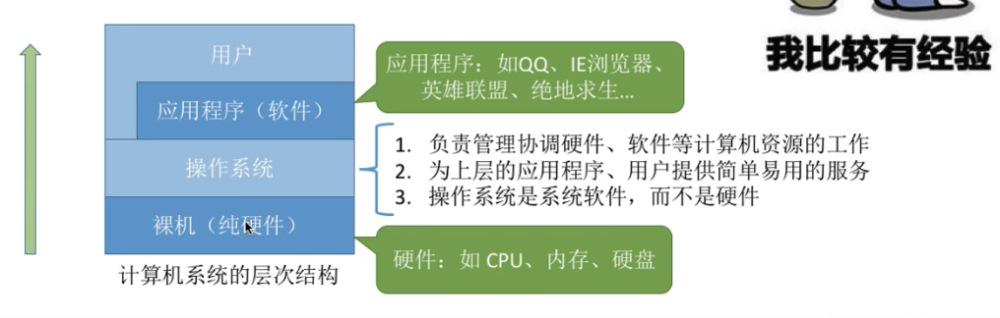
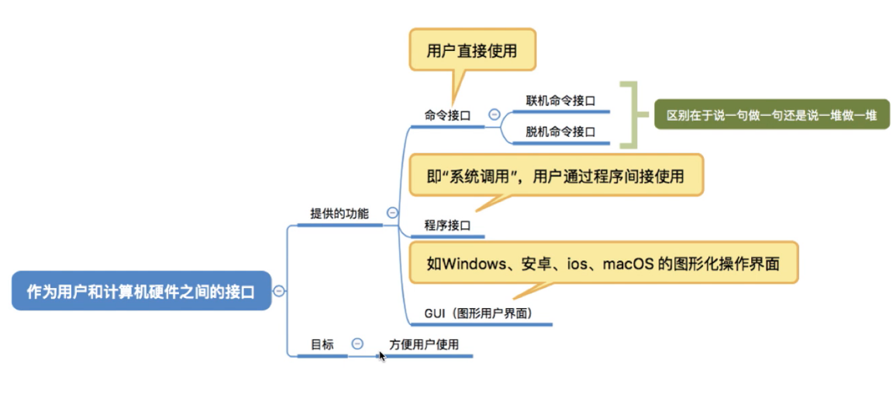
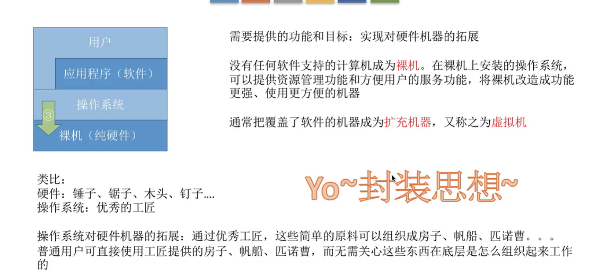

# 操作系统的概念、功能、目标

## 概念

### 层次结构

- 操作系统： 操作软件和硬件的管理， 用户和计算机的接口、最接近硬件的层次
  
  

## 功能和目标

### 提供的功能

- 文件管理
- 存储器（内存）管理
- 处理机（cpu）管理
- 设备管理

### 作为用户和计算机硬件之间的接口

#### 命令接口

- 联机命令接口 = 交互命令接口 cmd工具
- 脱机命令接口 = 批处理命令接口 .bat 文件

#### 程序接口

- 通过程序调用 dll文件
- 由一组系统调用组成 程序接口=系统调用
- 系统调用 = 系统调用命令 = 广义指令

#### GUI 图像用户界面 

### 最接近硬件的层次

